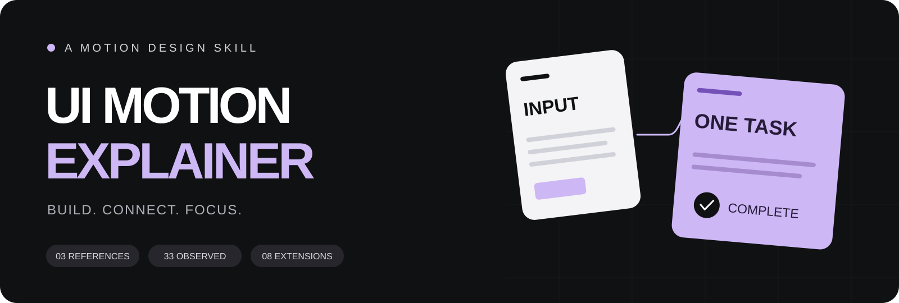
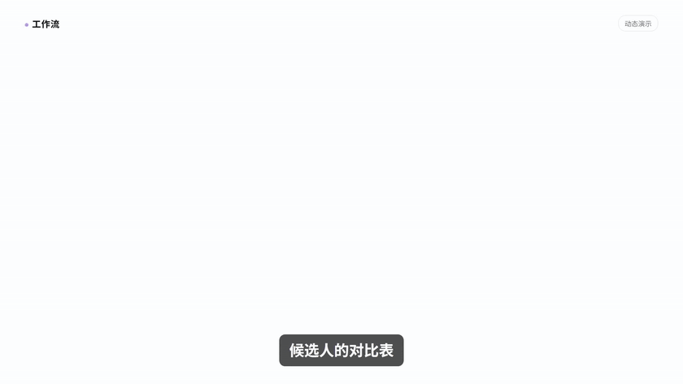
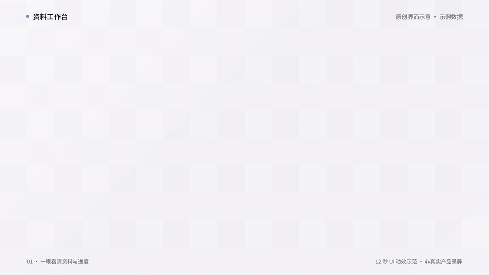

<div align="center">



# 黑白紫 UI 动态讲解

**把口播里的对象、关系和变化，剪成看得懂的动画。**

三条完整参考 · 33 类观察动作 · 23 类原创扩展 · 精致产品 UI · 可编辑工程

[每期不同的开场](references/opening-design.md) · [查看全部动效](docs/gallery.md) · [新动效 X21–X23](references/motion-lab.md) · [观看风格短样](assets/approved-demo/preview.mp4) · [产品 UI 示范](docs/ui-design.md) · [安装与使用](#安装与使用) · [下载 ZIP](https://github.com/3105059695-rgb/ui-motion-explainer/archive/refs/heads/main.zip)

</div>

---

## 先看效果

卡片依次建立，合并成一个结果；结果进入协作界面，背景退焦，结论留在前景。

<a href="assets/approved-demo/preview.mp4"></a>

**[播放 1080p 短样](assets/approved-demo/preview.mp4)** · [查看可编辑 HTML](assets/approved-demo/index.html) · [视觉与节奏规范](references/style-system.md)

## 2026-09-24 升级：每期不同的 AE 感开场

**统一 UI 语言，每期独立设计开场。** 沿用白底、近黑、紫色焦点与清楚的字体层级，根据本期内容改变主视觉事件、镜头路线、素材出场顺序和转场组合。

- 制作前比较能取得的近期开头，明确本期变化。历史记录缺失时继续设计，不假称已比较旧片。
- 从内容选择成果接管、字形进入、同物追踪、焦点切换等动作机制，组合出不同的镜头；只换标题、截图或大数字不算新开场。
- 将速度变化、运动模糊、对象遮罩与层级落实到中间帧，停稳后保证素材可读、人物和字幕不被遮挡。

入口、调用提示词与[完整开场规则](references/opening-design.md)已一起更新，单独下载本仓库即可读取；无需依赖作者电脑上的其他技能或路径。本次升级的是制作规则与选镜头方法，既有示范视频和运行依赖保持原版本，**未新增或重新验证一批特效视频**。实际制作效果仍需检查当期导出片段。

## 这套 Skill 做什么

适合 **AI 工具介绍、科技知识讲解、产品操作教程、工作流演示**。它把口播里的“几个任务”“一个结果”“不同方案”“某条约束”变成可见对象，再通过位置、大小、连接与状态变化讲清楚逻辑。

| 视觉语言 | 镜头逻辑 | 制作方式 |
|---|---|---|
| 白底、近黑卡片、淡紫焦点、粗中文无衬线 | 建立对象 → 改变关系 → 留出阅读时间 | HTML + GSAP / HyperFrames 优先，可映射到其他剪辑工具 |
| 圆角窗口、柔和阴影、克制的层次 | 图解讲原理，真实录屏展示操作 | 随包脚本处理字体与抽帧，保留可编辑工程 |

## 产品 UI：为讲解重新设计的界面

保留窗口、侧栏、表格和状态这些熟悉的软件结构，再重排内容密度、字号与焦点。关键字段可读，行与面板可以单独移动，适合制作用户所说的“像电脑截图，但更精致”的画面。

**只有文案、没有电脑素材，也可以直接制作。** Skill 会按内容选择对话、搜索、文档、文件管理、表格、看板、设置、日历或流程等界面，生成静态图或模拟操作片段。工作台只是一个示范；具体画面由文案决定。见 [文案 → 界面选型](references/ui-patterns.md)。

<a href="assets/ui-showcase/preview.mp4"></a>

**[播放 12 秒 UI 示范](assets/ui-showcase/preview.mp4)** · [两张参考与组件说明](docs/ui-design.md) · [可执行设计方法](references/ui-design.md) · [编辑界面源码](assets/ui-showcase/index.html)

| 可以制作 | 内容与交付 |
|---|---|
| 资料工作台、数据表、任务看板、对话窗口 | 用可信的示例内容搭建完整界面，重点字段用紫色强调 |
| 文档、搜索结果、侧边详情、协作状态 | 同一条目在前后状态保持身份，按讲解展开和收起 |
| 静态 UI 图 / 动态 UI 视频 | 从可编辑布局导出画面；也可接入口播、字幕与局部聚焦 |

本示范是原创演示界面。需要展示真实产品的操作结果时，以实际产品素材核对。

## 12 种口播效果，听着看更直观

**72 秒中文演示配音**，每种动作单独示范。强调、追问、因果、纠错、步骤、类比、数值、证据和总结，都有相应的动作配方。

| 把一句话拆成步骤 | 把抽象交接变成类比 |
|:---:|:---:|
| <a href="assets/narration-demos/preview.mp4"></a> | <a href="assets/narration-demos/preview.mp4"></a> |

**[播放完整口播合集](assets/narration-demos/preview.mp4)** · [12 项逐项预览](docs/gallery.md#narration) · [使用配方](references/narration-effects.md) · [文案与工程](assets/narration-demos/README.md)

## 三条参考，一个不漏

每条都提供 **完整原片、独立拆解、带时间码的动作索引**。下方 GIF 保留原画幅和画面署名，点击标题查看对应参考页。

| 01 · 工作流与协作 | 02 · 信息与上下文 | 03 · 技巧与操作 |
|:---:|:---:|:---:|
| [**豆包工作：面试流程一键搞定**](docs/sources/doubao.md) | [**Codex：上下文压缩失忆问题**](docs/sources/codex.md) | [**GPT6：节约 Token 的技巧**](docs/sources/token.md) |
|  |  |  |
| 多卡归并 · 结果拆出 · 协作接入 · 分支交接 | 文档滚动 · 搜索筛选 · 原文聚焦 · 窗口交接 | 条目升格 · 文件堆叠 · 状态灰化 · 人物引导 |
| [原片 · 3:07.7](docs/source-videos/doubao.mp4) | [原片 · 3:04.9](docs/source-videos/codex.mp4) | [原片 · 3:33.8](docs/source-videos/token.mp4) |

参考题目是原视频标题，片中产品宣传与技术结论不属于本仓库验证范围。来源署名与素材说明见 [CREDITS](CREDITS.md)。

## 新增 X21–X23：同一对象，连续变化

三段各 9 秒、1920×1080、50 fps 的无声原创示意：资料依次接管前景并归入文件；同一个仓库窗口推近条目后回到总览；数据文件沿曲线交接并展开成报告。

| X21 · 资料纵深归并 | X22 · 仓库窗口连续推镜 | X23 · 数据文件曲线交接 |
|:---:|:---:|:---:|
| <a href="assets/motion-lab/X21.mp4"></a> | <a href="assets/motion-lab/X22.mp4"></a> | <a href="assets/motion-lab/X23.mp4"></a> |

**[27 秒完整预览](assets/motion-lab/preview.mp4)** · [可编辑工程](assets/motion-lab/index.html) · [场景源码](assets/motion-lab/scenes) · [动作配方与模糊边界](references/motion-lab.md)

使用 HyperFrames 0.8.62 与上游 `motion-blur` 组件。已完成实际视频导出与检查；不作为真实产品操作或原参考片的证据。

## 56 种动作，都有对应示例

**O01–O33** 来自三条参考的实际画面；**X01–X23** 是沿用同一视觉语言的新设计。编号与 Skill 动效库一一对应。

| 对象与布局 | 注意力与交接 |
|:---:|:---:|
| <br />**O05 · 结果脱离容器**<br />一个人的对话结果，变成可独立使用的成果。 | <br />**O12 · 文档外加新容器**<br />文档保留位置，外部展开新的工作空间。 |
| <br />**O10 · 分支焦点交接**<br />讲新分支时，旧卡收起说明并保留标题。 | <br />**X02 · 保位排序**<br />内容身份不变，位置变化解释新的优先级。 |

### 按内容选动作

| 你想讲什么 | 推荐组合 | 去哪里看 |
|---|---|---|
| 多项工作合成一次任务 | 分批建立 → 归并 → 完成确认 | [卡片与布局](docs/gallery.md#cards) |
| 一件事经过几个环节 | 连续扩列 → 同一字段贯穿 → 结果停留 | [关系与交接](docs/gallery.md#relations) |
| 找到历史记录中的关键原话 | 逐字搜索 → 过滤 → 原文重排 → 高亮 | [界面与聚焦](docs/gallery.md#focus) |
| 原理说明之后展示真实操作 | 图解 → 匹配衔接 → 录屏推近 | [镜头与节奏](docs/gallery.md#editing) |
| 资料归档、条目定位、文件交付 | 纵深归并、连续推镜、曲线与遮罩交接 | [X21–X23](docs/gallery.md#motion-lab) |
| 需要更多变化 | 遮罩揭字、排序、局部放大、差异切换等 | [23 类扩展](docs/gallery.md#extensions) |

**[打开完整 56 项动效图鉴 →](docs/gallery.md)**

## 安装与使用

### Codex

将本仓库克隆到个人技能目录。目标目录已经存在时，先在原目录中查看变更并更新，避免把旧版本直接覆盖。

**Windows PowerShell**

```powershell
git clone https://github.com/3105059695-rgb/ui-motion-explainer.git "$HOME/.codex/skills/ui-motion-explainer"
```

**macOS / Linux**

```bash
git clone https://github.com/3105059695-rgb/ui-motion-explainer.git ~/.codex/skills/ui-motion-explainer
```

也可以下载 ZIP，将包含 `SKILL.md` 的 `ui-motion-explainer` 文件夹放入技能目录。

已通过 Git 安装的用户，先保存自己改过的文件，工作目录干净后在该技能目录运行 `git pull --ff-only`。ZIP 用户保留本地定制副本后下载新版。更新后让使用的工具重新加载技能；若当前任务仍缓存旧内容，开启新任务读取新版。

### 一句话调用

```text
使用 $ui-motion-explainer，把这段口播做成黑白紫 UI 动态讲解。
沿用 UI 风格，按本期内容独立设计有冲击力、转场丝滑的 AE 感开头。
对照能取得的近期开头，改变主视觉事件与镜头衔接，不沿用固定入场顺序。
真实素材对应口播，动作落定后保留阅读时间，交付 MP4 和可编辑工程。
```

更具体的请求：

```text
我只有文案，没有电脑录屏。请按各段内容直接设计 UI 素材：
查找信息可以用搜索页，解释改写可以用文档编辑器，任务流转可以用看板。
选择适合讲解的静态或动态画面，统一黑白紫风格，交付成片与源码。
```

```text
先做 20 秒短样：三个文档依次出现，合并成一次任务，
再展开团队界面，最后退焦突出结论。
```

```text
这段是搜索教程。请使用搜索输入、过滤上移、原文重排和逐行高亮，
让操作过程与口播对应，保留查询词和原文出处。
```

```text
做一个三分钟完整教程。参考这套视觉语言，
在关系图解和真实录屏之间切换，按语义设计新的动效组合。
```

也可以只做精致的静态界面：

```text
使用 $ui-motion-explainer，做一张产品 UI 示意图：
资料工作台，包含侧栏、筛选工具栏、数据表和右侧详情。
参考黑白紫风格，正文足够大，保留可编辑源码，并导出高清图片。
```

## 规范和工程在哪里

| 文件 | 用途 |
|---|---|
| [SKILL.md](SKILL.md) | 技能入口、动作选择、制作顺序与完成标准 |
| [style-system.md](references/style-system.md) | 色彩、字体、布局、节奏与口播处理 |
| [opening-design.md](references/opening-design.md) | 每期独立开场、近期差异比较、镜头机制与动态检查 |
| [effects.md](references/effects.md) | 33 类参考动作 + 23 类扩展的触发条件与实现建议 |
| [ui-design.md](references/ui-design.md) | 产品 UI 重建、组件结构、信息层级与动静态交付 |
| [ui-patterns.md](references/ui-patterns.md) | 没有电脑素材时，按文案选择界面布局与模拟操作 |
| [narration-effects.md](references/narration-effects.md) | X09–X20 口播触发、动作配方、边界与组合 |
| [motion-lab.md](references/motion-lab.md) | X21–X23 纵深归并、连续推镜、曲线交接与运动模糊接入 |
| [production.md](references/production.md) | 字体子集、时间轴、音画同步与导出检查 |
| [reference-evidence.md](references/reference-evidence.md) | 来源、观察边界与样例验证记录 |
| [动效图鉴](docs/gallery.md) | 56 项逐项入口，链接到来源与工程 |
| [风格短样工程](assets/approved-demo) | 18 秒完整组合，可编辑 HTML 和素材 |
| [扩展演示工程](assets/extension-demos) | 8 个新设计动作的分段演示与源码 |
| [口播演示工程](assets/narration-demos) | 12 个新动作、72 秒配音、字幕、时间表与源码 |
| [资料工作台工程](assets/ui-showcase) | 完整界面 → 选中详情 → 团队交接，静态帧与动态图 |
| [连续对象动效工程](assets/motion-lab) | X21–X23，3 段 9 秒无声示意，独立场景源码 |
| [辅助脚本](scripts) | 字体准备、参考抽帧及媒体索引 |

### 本地预览与导出

复制样例目录作为新项目，再改写内容。已输出的 MP4 和 GIF 可以直接查看；编辑并渲染 HTML 需要 Node.js、HyperFrames 及其浏览器运行环境。

```bash
cd assets/approved-demo
npm install
npm run check
npm run dev
npm run render
```

旧示例的参考运行版本为 HyperFrames `0.8.38`；新增 `assets/motion-lab/` 锁定 `0.8.62`，使用该目录自己的依赖和命令。中文字体使用 Noto Sans SC 子集。修改文案后要重新生成字形子集，并检查实际导出帧。

## 使用边界

本项目提供动效设计方法和工程示例。具体软件功能、数字或宣传结论仍需按新任务核实；生成的演示 UI 应明确标注。新作品按内容与素材选择音频，不自动沿用参考作者的旁白或形象。

原创代码与文档采用 [MIT License](LICENSE)。参考视频、从参考抽取的 GIF/截图、原混音、GSAP、字体与 HyperFrames 上游 `motion-blur` 组件分别按 [素材与第三方说明](CREDITS.md) 处理，**不包含在原创代码的 MIT 授权中**；该上游组件采用 Apache-2.0。

---

<div align="center">

**先让观众理解变化，再让画面好看。**

[开始使用](SKILL.md) · [看全部效果](docs/gallery.md) · [反馈与建议](https://github.com/3105059695-rgb/ui-motion-explainer/issues)

</div>
