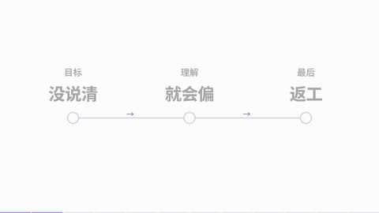
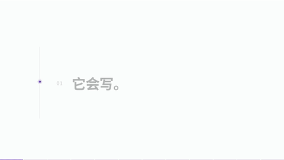
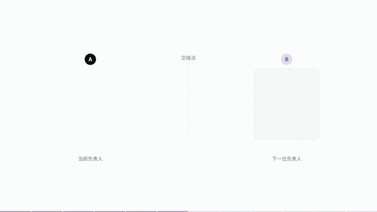

# 12 种口播讲解新动效

延续黑、白、淡紫的 UI 讲解风格，为讲解中的不同语义设计动作。每段 6 秒，完整示范 72 秒，使用中文标准合成演示配音。

## 观看与选择

[播放完整样片](preview.mp4) · [全部关键帧](review/contact-sheet.jpg) · [可编辑 HTML](index.html)

| 时间 | 编号 / 效果 | 口播触发 | 画面怎样解释 |
|---|---|---|---|
| 00:00–00:06 | X09 重音接力 | “先看……再看……最后……” | 完整句保持，当前关键词升格，已讲的词归位 |
| 00:06–00:12 | X10 追问递进 | “会做，但能记住吗？还能继续吗？” | 已知条件保留，问题逐层推进到真正关注点 |
| 00:12–00:18 | X11 因果传导 | “因为……导致……所以……” | 一个阅读焦点沿因果连线推进，最后点亮结果 |
| 00:18–00:24 | X12 误区纠正 | “这个说法不一定，关键是……” | 先显出常见误解，再划去错误关系，建立可执行替代 |
| 00:24–00:30 | X13 句子拆步骤 | “先给材料，再定目标，最后说交付” | 同一句里的短语保持身份，分别进入编号步骤槽 |
| 00:30–00:36 | X14 层层剖开 | “把它拆开看，里面有……” | 一个整体展开为三个可读层，当前讲到的层拉开 |
| 00:36–00:42 | X15 类比变形 | “可以把它想成……” | 交接文档变成接力棒，交到下一人再变回任务文档 |
| 00:42–00:48 | X16 数值尺量 | “从十个，缩到三个” | 可数刻度和括尺一起回缩，让数量变化看得见 |
| 00:48–00:54 | X17 时间折叠 | “现在做这个，其余按需展开” | 当前步骤保留，后续流程折叠成一个可展开分组 |
| 00:54–01:00 | X18 证据落点 | “这个结论，对应哪条原文？” | 从结论脚注连回文档，只定位对应的句子 |
| 01:00–01:06 | X19 首尾回扣 | “回到开头的问题……” | 问题先收成书签，解释结束后从同一位置拉回并回答 |
| 01:06–01:12 | X20 结论拼句 | “这些要点，合成一句话……” | 多个关键词按新关系拼成一句完整结论 |

所有效果均为新设计，不作为原参考片里已经出现过的动作证据。流程数字和界面文本是演示内容。

## 动态预览

| 重音 / 追问 | 因果 / 纠错 |
|---|---|
|  |  |
|  |  |

| 步骤 / 结构 | 类比 / 数值 |
|---|---|
|  |  |
|  |  |

| 时间 / 证据 | 回扣 / 总结 |
|---|---|
|  |  |
|  |  |

## 编辑工程

- `narration-plan.json`：12 段文案、教学用途和设计动作。
- `assets/narration-timing.json`：每一句演示口播的实际起止时间。
- `parts/part-a.json` / `part-b.json`：分段 CSS、HTML 和 GSAP 时间轴源代码。
- `build.py`：把视觉、字幕和音频时点装成完整工程，生成所需字形子集。
- `index.html`：已构建的完整可编辑动画；`package.json` 固定 HyperFrames 0.8.38。

`at('X09', 0)` 表示该段第一句的全局起点。替换配音时要重新测量时间，并同时调整动作与字幕，不能只替换音频文件。

```bash
npm install
npm run check
npm run dev
npm run render
```

重新构建需要 Python 的 fonttools / brotli 和 Noto Sans SC 字体源文件：

```bash
python build.py --font /path/to/NotoSansSC.ttf
```

## 素材说明

画面是新制作的 HTML / SVG 图解。中文演示配音使用本机 Windows 标准中文语音，未克隆参考作者声音。字体为 Noto Sans SC 字形子集，许可证见 `assets/NotoSansSC-OFL.txt`；GSAP 保留库文件头中的原版权与许可说明。
