# 56 项动效图鉴

[返回首页](../README.md) · [完整动效规范](../references/effects.md) · [素材署名](../CREDITS.md)

**O01–O33：原片节选。X01–X23：原创扩展，共 56 项。** 实际截取时间与观察说明分开记录。GIF 保留必要的前后状态；实现建议见动效规范。新增 X21–X23 已实际导出并检查，详见[验证记录](../assets/motion-lab/verification.md)。

[卡片布局](#cards) · [关系交接](#relations) · [界面聚焦](#focus) · [镜头节奏](#editing) · [基础扩展](#extensions) · [口播扩展](#narration) · [连续对象扩展](#motion-lab) · [产品 UI](ui-design.md)

## 01 · 卡片、对象与连续布局

| 动作预览 | 动作预览 |
|:---|:---|
| <strong>O01 · 分批建立</strong>  <a href='sources/doubao.md'>D · 00:18.70–00:20.70</a> · 原片节选  一组项目逐项被提及；空场 → 对象陆续出现 → 总览 | <strong>O02 · 当前对象放大</strong> 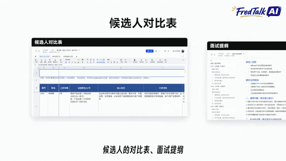 <a href='sources/doubao.md'>D · 00:13.00–00:17.00</a> · 原片节选  从一组文件中选择一个；保留邻居边缘，选中项移到中心 |
| <strong>O03 · 景深堆叠</strong>  <a href='sources/token.md'>G · 00:31.50–00:34.00</a> · 原片节选  表达文件多、步骤繁；原窗口缩小让位，额外文档带轻角度堆叠 | <strong>O04 · 多卡归并</strong> 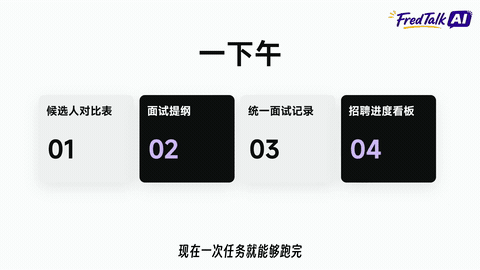 <a href='sources/doubao.md'>D · 00:20.40–00:22.00</a> · 原片节选  多项工作成为一次任务/统一结果；同一组卡片向同一目标收拢 |
| <strong>O05 · 结果脱离容器</strong> 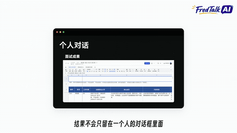 <a href='sources/doubao.md'>D · 00:28.10–00:30.20</a> · 原片节选  个人对话产物转成可共享对象；旧窗口收窄左移，结果脱离并在右边展开 | <strong>O06 · 同一窗口换内容</strong> 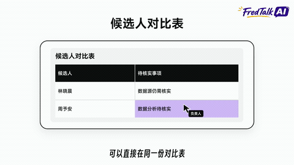 <a href='sources/doubao.md'>D · 00:47.00–00:51.00</a> · 原片节选  同一工作空间输出多种结果；保留外壳，替换内部内容和标题 |
| <strong>O07 · 网格积累</strong> 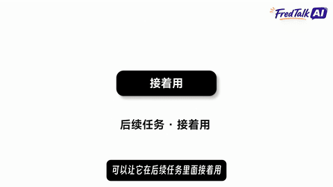 <a href='sources/token.md'>G · 01:31.50–01:33.50</a> · 原片节选  概念逐项组成一个集合；先一格，后完整网格 | <strong>O08 · 连续扩列</strong>  <a href='sources/doubao.md'>D · 00:58.50–01:03.00</a> · 原片节选  流程增加下一站；旧列让位，新列进入，最后形成三列链条 |

[回到目录](#56-项动效图鉴)

## 02 · 关系、分支与交接

| 动作预览 | 动作预览 |
|:---|:---|
| <strong>O09 · 分支生长</strong> 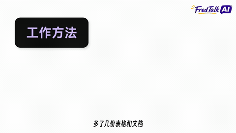 <a href='sources/doubao.md'>D · 02:40.50–02:46.00</a> · 原片节选  一个主题对应多个方面；主节点 → 连线 → 子节点 → 说明 | <strong>O10 · 分支焦点交接</strong> 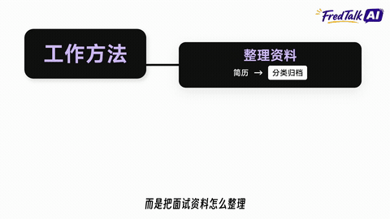 <a href='sources/doubao.md'>D · 02:42.50–02:46.00</a> · 原片节选  逐项讲复杂分支；新分支打开时旧分支收起副文案、压成标题窄卡 |
| <strong>O11 · 字段贯穿链条</strong>  <a href='sources/doubao.md'>D · 00:58.50–01:03.00</a> · 原片节选  同一信息从记录到任务再到群聊；多端保留同一关键字段 | <strong>O12 · 文档外加新容器</strong> 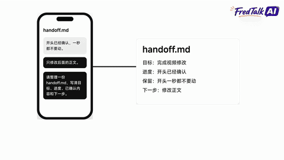 <a href='sources/codex.md'>C · 02:48.20–02:50.50</a> · 原片节选  文档被新会话或系统继承；文档保留位置，背后展开新窗口 |
| <strong>O13 · 并置比较</strong> 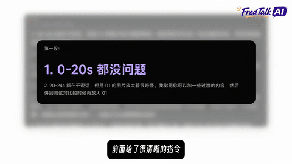 <a href='sources/codex.md'>C · 00:10.80–00:13.00</a> · 原片节选  原文/摘要、主任务/支线、方案 A/B；从单对象扩展为双栏 | <strong>O14 · 数量级对比</strong>  <a href='sources/codex.md'>C · 00:53.50–00:57.50</a> · 原片节选  比较容量、成本、比例；灰色旧值与更显著的新值并列 |

[回到目录](#56-项动效图鉴)

## 03 · 界面状态与注意力

| 动作预览 | 动作预览 |
|:---|:---|
| <strong>O15 · 开关和进度</strong> 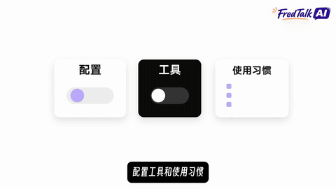 <a href='sources/token.md'>G · 00:07.00–00:10.00</a> · 原片节选  能力启用、剩余额度、步骤状态；状态改变可见 | <strong>O16 · 完成勾选</strong> 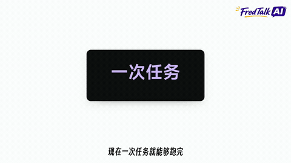 <a href='sources/doubao.md'>D · 00:21.25–00:22.80</a> · 原片节选  任务确实完成或清单逐项核对 |
| <strong>O17 · 背景退焦</strong> 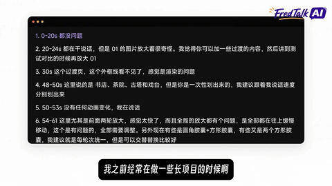 <a href='sources/codex.md'>C · 00:09.00–00:11.00</a> · 原片节选  当前场景仍是上下文，但读者应看一句结论 | <strong>O18 · 关键词提取</strong> 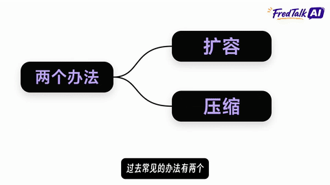 <a href='sources/codex.md'>C · 00:50.00–00:52.00</a> · 原片节选  从窗口里抽出真正重要的一句/一个概念 |
| <strong>O19 · 协作接入</strong> 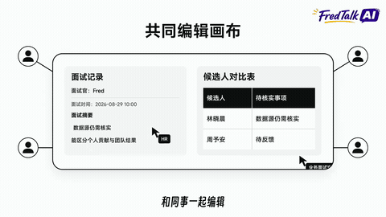 <a href='sources/doubao.md'>D · 00:41.00–00:46.00</a> · 原片节选  多角色共同处理同一对象 | <strong>O20 · 窗口内缩放滚动</strong>  <a href='sources/codex.md'>C · 01:48.00–01:54.00</a> · 原片节选  长文档需要逐段阅读；窗口固定，正文放大并滚到当前字段 |
| <strong>O21 · 累积荧光笔</strong>  <a href='sources/codex.md'>C · 01:51.80–01:54.50</a> · 原片节选  多条约束都要保留；文字不动，底色从左向右扫出 | <strong>O22 · 搜索逐字输入</strong> 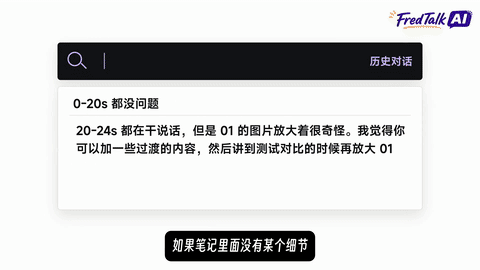 <a href='sources/codex.md'>C · 02:05.40–02:07.40</a> · 原片节选  检索过程和查询词本身有意义 |
| <strong>O23 · 过滤并上移</strong> 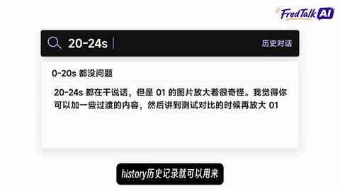 <a href='sources/codex.md'>C · 02:07.40–02:09.40</a> · 原片节选  从多个结果中找到匹配项 | <strong>O24 · 原文重排强调</strong> 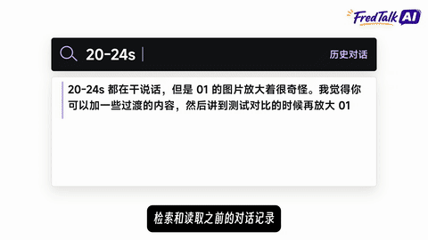 <a href='sources/codex.md'>C · 02:10.30–02:13.20</a> · 原片节选  找到记录后解释真正关键的一句话 |
| <strong>O25 · 消失或灰化</strong>  <a href='sources/token.md'>G · 02:59.00–03:03.00</a> · 原片节选  解释信息丢失、步骤取消或旧做法降级 | <strong>O26 · 状态标签切词</strong>  <a href='sources/codex.md'>C · 02:43.00–02:47.00</a> · 原片节选  流程状态更新但对象位置不变 |
| <strong>O27 · 选中文字再替换</strong>  <a href='sources/token.md'>G · 00:28.80–00:31.60</a> · 原片节选  提示词、按钮标签或规则被修改 | <strong>O28 · 条目升格为主结论</strong>  <a href='sources/token.md'>G · 00:15.60–00:18.50</a> · 原片节选  某一行规则值得重点解释 |

[回到目录](#56-项动效图鉴)

## 04 · 镜头与段落节奏

| 动作预览 | 动作预览 |
|:---|:---|
| <strong>O29 · 标志让位</strong>  <a href='sources/doubao.md'>D · 00:00.00–00:03.00</a> · 原片节选  从产品名进入解释 | <strong>O30 · 真实录屏聚焦</strong> 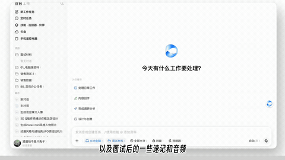 <a href='sources/doubao.md'>D · 01:17.30–01:20.80</a> · 原片节选  观众需要看清操作位置 |
| <strong>O31 · 黑色章节页</strong> 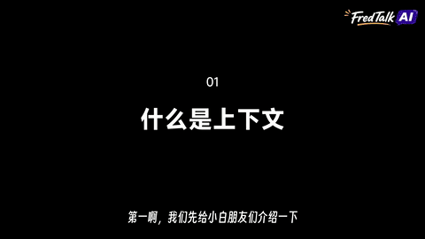 <a href='sources/codex.md'>C · 00:35.50–00:38.50</a> · 原片节选  主题层级发生变化 | <strong>O32 · 场景水平接力</strong>  <a href='sources/token.md'>G · 00:05.10–00:07.20</a> · 原片节选  前后是明确的新段，但需要方向感 |
| <strong>O33 · 人物引导与回收</strong>  <a href='sources/token.md'>G · 03:13.00–03:16.50</a> · 原片节选  开场建立讲解感、结尾逐项总结 | 按语义组合动作，给结果留出阅读时间。 |

[回到目录](#56-项动效图鉴)

## 05 · 兼容扩展：新设计演示

以下是同一风格语言下的新设计，不作为原参考片的观察证据。X04 展示图解到实录的对位方法，画面明确标记为示意。

[播放 32 秒扩展合集](../assets/extension-demos/preview.mp4) · [编辑工程](../assets/extension-demos/index.html)

| 动作预览 | 动作预览 |
|:---|:---|
| <strong>X01 · 遮罩揭字</strong>  <a href='../assets/extension-demos/preview.mp4'>00:00.00–00:04.00</a> · 扩展演示 · <a href='../assets/extension-demos/index.html'>源码</a>  标题包含需要按语义分开的两三部分 | <strong>X02 · 保位排序</strong> 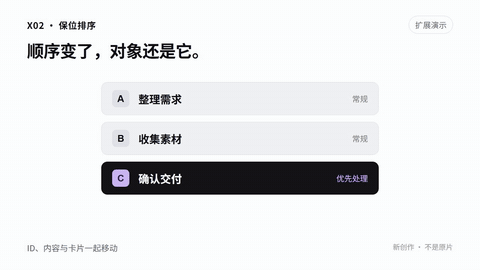 <a href='../assets/extension-demos/preview.mp4'>00:04.00–00:08.00</a> · 扩展演示 · <a href='../assets/extension-demos/index.html'>源码</a>  优先级、排名、筛选顺序实际变化 |
| <strong>X03 · 局部放大镜</strong>  <a href='../assets/extension-demos/preview.mp4'>00:08.00–00:12.00</a> · 扩展演示 · <a href='../assets/extension-demos/index.html'>源码</a>  必须同时保留整体位置和一个微小字段 | <strong>X04 · 图解匹配到实录</strong>  <a href='../assets/extension-demos/preview.mp4'>00:12.00–00:16.00</a> · 扩展演示 · <a href='../assets/extension-demos/index.html'>源码</a>  简化 UI 讲完，接下来要证明真实操作 |
| <strong>X05 · 分段步骤条</strong>  <a href='../assets/extension-demos/preview.mp4'>00:16.00–00:20.00</a> · 扩展演示 · <a href='../assets/extension-demos/index.html'>源码</a>  有明确顺序且需要让用户记住当前步骤 | <strong>X06 · 差异层切换</strong> 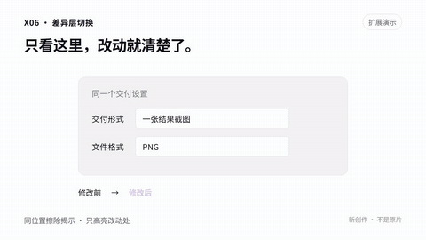 <a href='../assets/extension-demos/preview.mp4'>00:20.00–00:24.00</a> · 扩展演示 · <a href='../assets/extension-demos/index.html'>源码</a>  比较修改前后同一个区域 |
| <strong>X07 · 局部跟随聚焦</strong>  <a href='../assets/extension-demos/preview.mp4'>00:24.00–00:28.00</a> · 扩展演示 · <a href='../assets/extension-demos/index.html'>源码</a>  同一区域中的目标连续移动，例如拖动排序 | <strong>X08 · 轻微纵深翻面</strong>  <a href='../assets/extension-demos/preview.mp4'>00:28.00–00:32.00</a> · 扩展演示 · <a href='../assets/extension-demos/index.html'>源码</a>  正反面本身有意义，如问题与答案、输入与输出 |

[回到目录](#56-项动效图鉴)

## 06 · 口播讲解：带配音的新设计

根据口播语义设计的 12 种新动作，每段 6 秒。完整 MP4 带中文合成演示配音，下方 GIF 为静音预览。

[播放 72 秒口播合集](../assets/narration-demos/preview.mp4) · [口播配方](../references/narration-effects.md) · [文案与工程](../assets/narration-demos/README.md)

| 动作预览 | 动作预览 |
|:---|:---|
| <strong>X09 · 重音接力</strong>  <a href='../assets/narration-demos/preview.mp4'>00:00.00–00:06.00</a> · 中文配音示范 · <a href='../assets/narration-demos/index.html'>源码</a>  一句话里的两三项重点 | <strong>X10 · 追问递进</strong>  <a href='../assets/narration-demos/preview.mp4'>00:06.00–00:12.00</a> · 中文配音示范 · <a href='../assets/narration-demos/index.html'>源码</a>  从表面问题追到真正需求 |
| <strong>X11 · 因果传导</strong>  <a href='../assets/narration-demos/preview.mp4'>00:12.00–00:18.00</a> · 中文配音示范 · <a href='../assets/narration-demos/index.html'>源码</a>  有依据的原因到结果 | <strong>X12 · 误区纠正</strong>  <a href='../assets/narration-demos/preview.mp4'>00:18.00–00:24.00</a> · 中文配音示范 · <a href='../assets/narration-demos/index.html'>源码</a>  常见说法需要准确替代 |
| <strong>X13 · 句子拆步骤</strong>  <a href='../assets/narration-demos/preview.mp4'>00:24.00–00:30.00</a> · 中文配音示范 · <a href='../assets/narration-demos/index.html'>源码</a>  将口头说明转成行动清单 | <strong>X14 · 层层剖开</strong>  <a href='../assets/narration-demos/preview.mp4'>00:30.00–00:36.00</a> · 中文配音示范 · <a href='../assets/narration-demos/index.html'>源码</a>  一个概念包含多层组成 |
| <strong>X15 · 类比变形</strong>  <a href='../assets/narration-demos/preview.mp4'>00:36.00–00:42.00</a> · 中文配音示范 · <a href='../assets/narration-demos/index.html'>源码</a>  用熟悉物件解释抽象关系 | <strong>X16 · 数值尺量</strong>  <a href='../assets/narration-demos/preview.mp4'>00:42.00–00:48.00</a> · 中文配音示范 · <a href='../assets/narration-demos/index.html'>源码</a>  数量或步骤确有变化 |
| <strong>X17 · 时间折叠</strong> 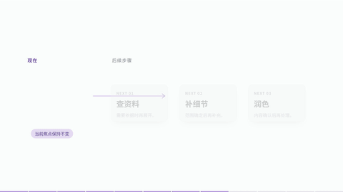 <a href='../assets/narration-demos/preview.mp4'>00:48.00–00:54.00</a> · 中文配音示范 · <a href='../assets/narration-demos/index.html'>源码</a>  当前执行与后续按需处理 | <strong>X18 · 证据落点</strong>  <a href='../assets/narration-demos/preview.mp4'>00:54.00–01:00.00</a> · 中文配音示范 · <a href='../assets/narration-demos/index.html'>源码</a>  结论需要追溯原文 |
| <strong>X19 · 首尾回扣</strong> 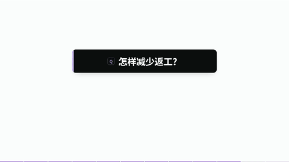 <a href='../assets/narration-demos/preview.mp4'>01:00.00–01:06.00</a> · 中文配音示范 · <a href='../assets/narration-demos/index.html'>源码</a>  解释后回答开头问题 | <strong>X20 · 结论拼句</strong>  <a href='../assets/narration-demos/preview.mp4'>01:06.00–01:12.00</a> · 中文配音示范 · <a href='../assets/narration-demos/index.html'>源码</a>  多个要点需要归纳 |

[回到目录](#56-项动效图鉴)

## 07 · 连续对象扩展 X21–X23

三段各 9 秒、1080p、50 fps 无声原创示意。快速到位后停读，前后保持同一对象身份；人物、字幕与真实录屏按新素材另排。

[27 秒完整预览](../assets/motion-lab/preview.mp4) · [可编辑工程](../assets/motion-lab/index.html) · [动作与实现配方](../references/motion-lab.md)

| 动作预览 | 动作流程与源码 |
|:---|:---|
| <strong>X21 · 资料纵深归并</strong>  | 网页摘录 → 选题笔记 → 内容提纲 → 同一文件与引用。  [独立 MP4](../assets/motion-lab/X21.mp4) · 总览 00:00–00:09 · [depth.js](../assets/motion-lab/scenes/depth.js) |
| <strong>X22 · 仓库窗口连续推镜</strong> <a href="../assets/motion-lab/X22.mp4">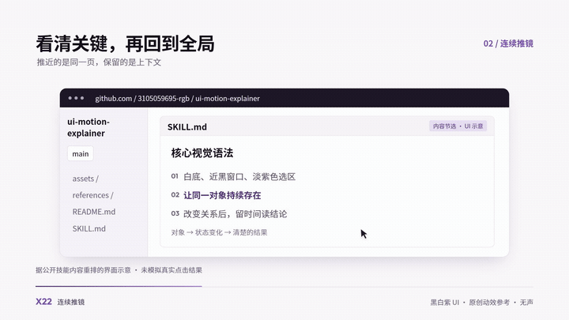</a> | 总览 → 推近关键条目 → 选区阅读 → 回到总览。  [独立 MP4](../assets/motion-lab/X22.mp4) · 总览 00:09–00:18 · [zoom.js](../assets/motion-lab/scenes/zoom.js) |
| <strong>X23 · 数据文件曲线交接</strong> <a href="../assets/motion-lab/X23.mp4">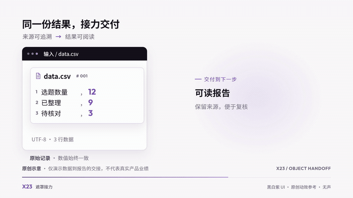</a> | 数据文件抬起 → 曲线移交 → 停稳 → inset 展开同一报告。  [独立 MP4](../assets/motion-lab/X23.mp4) · 总览 00:18–00:27 · [handoff.js](../assets/motion-lab/scenes/handoff.js) |

这组演示使用 HyperFrames 0.8.62。运动模糊只作用于适合采样的快速移动；上游子节点样式缓存的限制及 X21 在折叠前关闭副本的方法，见 [接入说明](../references/motion-lab.md#接入运动模糊与时间轴)。实际检查范围及剩余提示见[验证记录](../assets/motion-lab/verification.md)。

[回到目录](#56-项动效图鉴)
