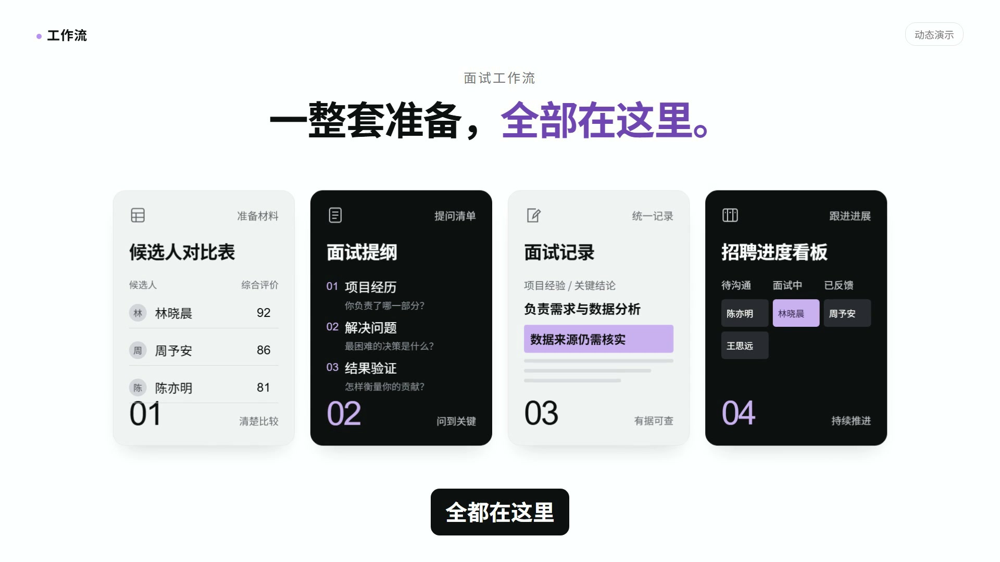
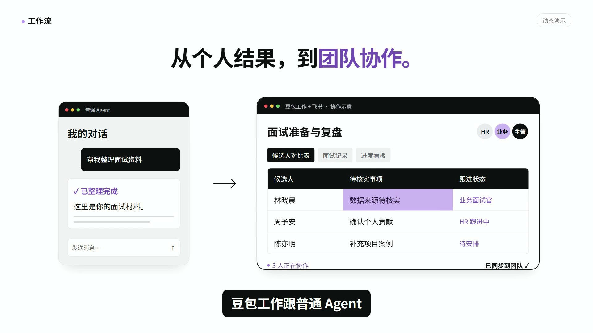
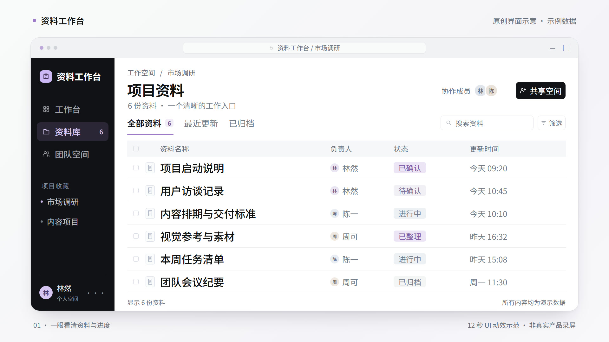
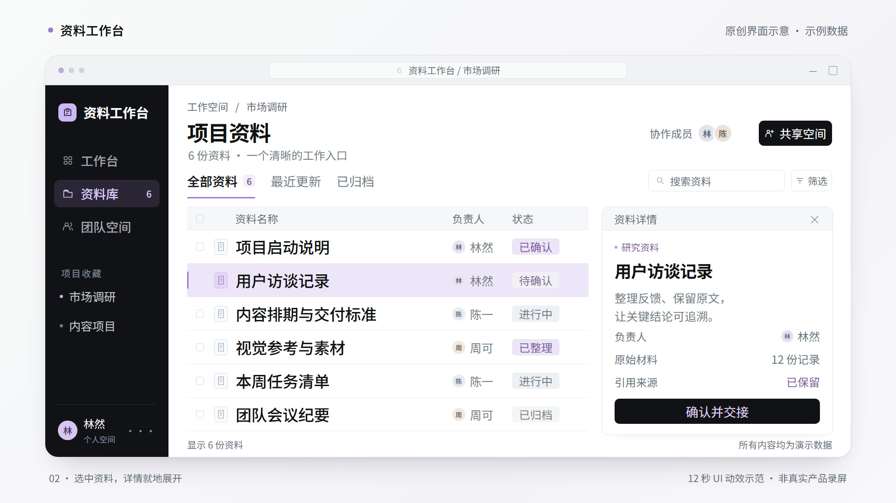
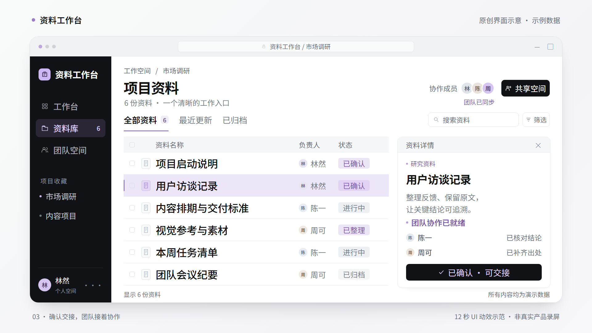

# 美化 UI：把工作流程排得更清楚

保留软件工作的真实结构，重新安排信息密度、字号和焦点。画面有电脑界面的细节，也能让观众一眼看到正在讲的内容。

[制作指南](../references/ui-design.md) · [动效图鉴](gallery.md) · [项目首页](../README.md)

## 没有录屏，也能按文案做素材

根据讲解内容直接搭建界面：讲提问用对话，讲查找用搜索，讲改写用文档，讲任务流转用看板，讲选项用设置。可以输出截图式静态图，也可以演示输入、选择、滚动、展开和反馈。更多布局见 [文案与界面选型](../references/ui-patterns.md)。下方工作台是其中一个已制作的示范。

## 已确认短样中的两个布局

### 1. 有内容的卡片总览

表格、提纲、记录、看板分别拥有自己的内部结构。统一的圆角、字号和间距把它们组织成一组；黑白交替建立层次，淡紫标出当前重点。换一个主题时，也可以换成素材、分析、方案、交付等对象。

### 2. 对话与团队工作区并置

左侧保留请求和产物，右侧展开工具标签、协作角色、表格与跟进状态。同一件事从个人结果延续到团队处理，观众能看清对象去了哪里、谁在继续使用。

两张图均来自 [已确认短样工程](../assets/approved-demo/index.html)，是为讲解重新搭建的界面。配图直接从工程成片导出，未把用户截图中的播放器界面带进设计。

## 新示范：资料工作台

下面用原创工作台示意，展示同一套规则如何迁移到新的内容。三个画面围绕同一个工作空间组织：先看资料总览，再打开当前条目，最后交代协作状态。

[观看 12 秒静音 MP4](../assets/ui-showcase/preview.mp4) · [查看可编辑 HTML 源码](../assets/ui-showcase/index.html)

| 总览 | 局部详情 | 团队协作 |
|---|---|---|
|  |  |  |
| 3.6 秒：侧栏、工具栏与六行资料表构成总览。 | 7.5 秒：选中“用户访谈记录”，列表让位，右侧展开该条目的详情。 | 11.5 秒：同一条目确认后显示协作就绪，名称与选中位置保持连续。 |

无损静态图：[总览 PNG](../assets/ui-showcase/overview.png) · [详情 PNG](../assets/ui-showcase/detail.png) · [协作 PNG](../assets/ui-showcase/team.png)

这是**原创界面示意**，全部使用示例数据，不对应特定品牌或真实产品功能。它展示的是布局与状态变化。

## 使用时抓住四件事

1. **任务结构清楚。** 名称、字段、负责人、状态和产物之间能对应起来。
2. **主要内容够大。** 精简无关菜单和冗余区域，把空间留给要讲的对象。
3. **前后状态连续。** 选中行打开自己的详情，同一张任务卡进入下一状态，原对象保留身份。
4. **来源模式明确。** 真实产品操作使用真实依据；重新排版的界面说明为讲解重建；自由设计的工作台说明为原创示意。

可用于**静态 PNG + 可编辑源码**，也可继续制作**动态 MP4 + 可编辑工程**。窗口壳、表格、看板、对话、文档、搜索与协作组件可以按不同主题重新组合。
